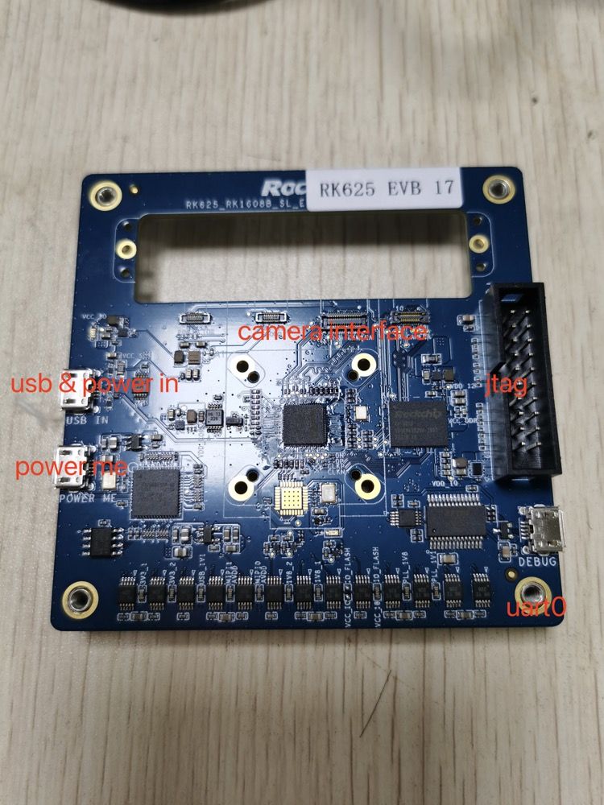
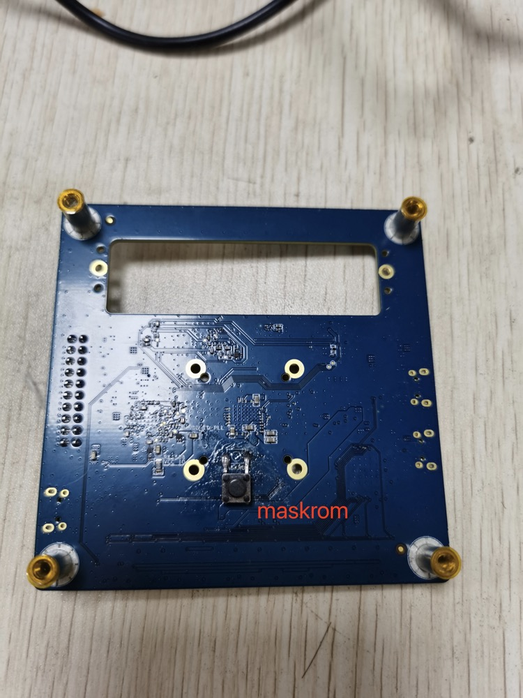
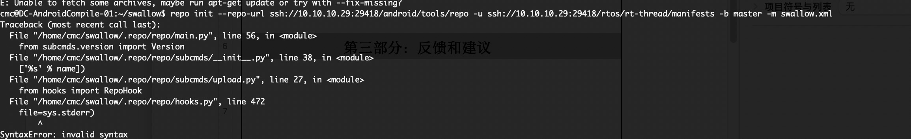

# Rockchip RK625 EVB FAQ

文件标识：RK-KF-YF-139

发布版本：V1.0.0

日期：2020-12-24

文件密级：□绝密   □秘密   □内部资料   ■公开

**免责声明**

本文档按“现状”提供，瑞芯微电子股份有限公司（“本公司”，下同）不对本文档的任何陈述、信息和内容的准确性、可靠性、完整性、适销性、特定目的性和非侵权性提供任何明示或暗示的声明或保证。本文档仅作为使用指导的参考。

由于产品版本升级或其他原因，本文档将可能在未经任何通知的情况下，不定期进行更新或修改。

**商标声明**

“Rockchip”、“瑞芯微”、“瑞芯”均为本公司的注册商标，归本公司所有。

本文档可能提及的其他所有注册商标或商标，由其各自拥有者所有。

**版权所有 © 2020 瑞芯微电子股份有限公司**

超越合理使用范畴，非经本公司书面许可，任何单位和个人不得擅自摘抄、复制本文档内容的部分或全部，并不得以任何形式传播。

瑞芯微电子股份有限公司

Rockchip Electronics Co., Ltd.

地址：     福建省福州市铜盘路软件园A区18号

网址：     [www.rock-chips.com](http://www.rock-chips.com)

客户服务电话： +86-4007-700-590

客户服务传真： +86-591-83951833

客户服务邮箱： [fae@rock-chips.com](mailto:fae@rock-chips.com)

---

**前言**

**概述**

本文提供RK625 EVB板的常见问题解答。

**产品版本**

| **芯片名称** | **内核版本** |
| ------------ | ------------ |
| RK625    | 通用 |

**读者对象**

本文档（本指南）主要适用于以下工程师：

技术支持工程师

软件开发工程师

**修订记录**

| **版本号** | **作者** | **修改日期** | **修改说明** |
| ---------- | --------| :--------- | ------------ |
| V1.0.0    | 陈谋春 | 2020-12-24 | 初始版本     |

---

**目录**

[TOC]

---

## 1. 编译环境配置

RK625的编译环境和我司以往RTT平台的搭建并无不同，可参见[开发指南中开发环境搭建章节](../../../quick-start/Rockchip_Developer_Guide_RT-Thread/Rockchip_Developer_Guide_RT-Thread_CN.html#2-开发环境搭建)。

## 2. 工程下载

```shell
mkdir swallow
cd swallow
repo init --repo-url ssh://10.10.10.29:29418/android/tools/repo -u ssh://10.10.10.29:29418/rtos/rt-thread/manifests -b master -m swallow.xml
.repo/repo/repo sync
```

## 3. 开发板介绍





## 4. 编译与烧写

```shell
cd bsp/rockchip/swallow
cp board/evb/defconfig .config   # 选择EVB板默认的配置
scons --menuconfig      # 根据实际情况调整部分配置，例如摄像头型号等，注意：即使没有任何修改，也要在退出前保存一下，确保rtconfig.h被更新，你的配置才会真正生效
./build.sh    # 编译和固件打包
./update_firmware.sh   # 烧写固件，需要设备已经处于maskrom状态
```

## 5. REPO SYNC问题

公版的REPO工具在某些版本的ubuntu环境下会报错，具体如下：



可以切到瑞芯微的REPO工具来解决问题，具体方法如下：

```shell
git clone "ssh://cliff.chen@10.10.10.29:29418/android/tools/repo"
export PATH=/path/to/your/repo:$PATH   # 把上面下载的repo目录加到系统的PATH里
```

## 6. JTAG和UART功能切换

RK625只有一个uart0，并且是和jtag功能复用的，芯片复位后默认是jtag状态，有两个开关来控制：iomux和串口连接；即只有iomux切到jtag，==并且串口处于断开状态==，jtag才能连上。OS这边通过RT_USING_JTAG来控制jtag的iomux，只要在menucofig里启用了这个选项后重新生成固件即可，具体方法如下：

```shell
scons --menuconfig    # 在配置里找到RT_USING_JTAG，启用后保存退出，再编译和烧录
```

同时，考虑到开发测试方便，os还提供一个动态切换命令'jtag'，运行后会自动把iomux切到jtag状态，==再拔掉串口==，接上jtag就可以调试了。

## 7. 如何打开HAL的打印

可以把HAL的打印转接到RTT这边，只要在bsp/rockchip/swallow/hal_conf.h加上如下定义即可：

```c
#define HAL_DBG_USING_RTT_SERIAL
#define HAL_DBG_ON
#define HAL_DBG_INFO_ON
```

## 8. 如何进maskrom烧写模式

可以选择下列方法中任意一个来切换maskrom状态：

- a. 按住maskrom按键，再上电

- b. os提供一个reboot命令支持重启或进maskrom，启用方法如下：

```shell
scons --menuconfig    # 在配置里找到RT_USING_RESET，启用后保存退出，再编译和烧录
# 下面命令需要在设备的串口控制台输入，请注意：
msh >reboot loader    # 如果不带loader参数，则是正常重启
```


